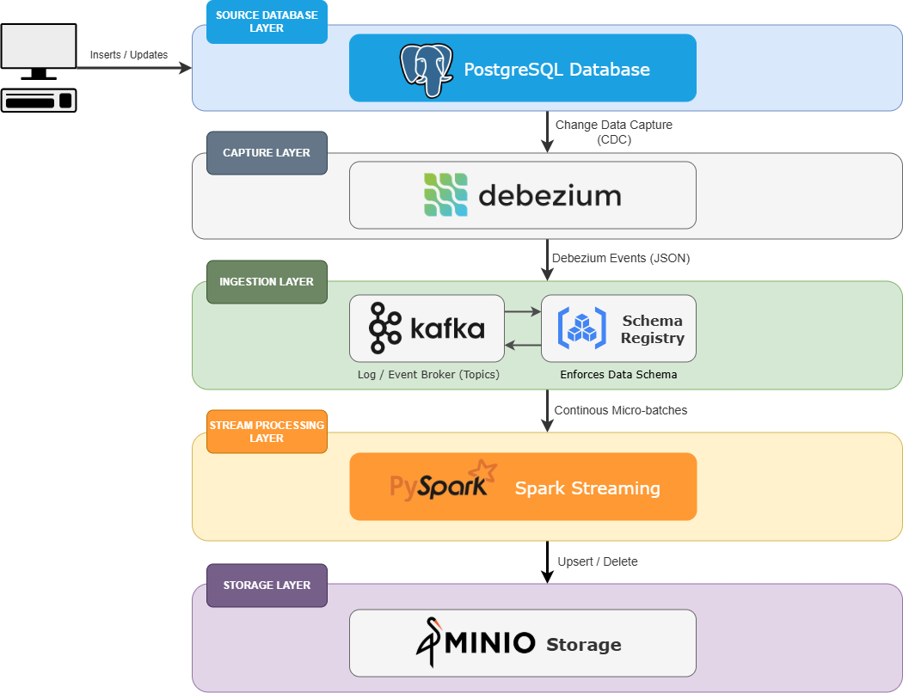

# cdc-data-pipeline

#### Architecture

<!-- Verify PostgreSQL + Replication Setup
Once up, connect to the DB:
docker compose up -d postgres
docker exec -it postgres psql -U airflow -d airflow

Then run:
-- Check logical replication readiness
SHOW wal_level;
SHOW max_replication_slots;
SHOW max_wal_senders;

-- Create a replication slot manually (for testing)
SELECT * FROM pg_create_logical_replication_slot('test_slot', 'pgoutput');
SELECT * FROM pg_replication_slots;

You should see:
wal_level = logical
max_replication_slots = 10
max_wal_senders = 10

🗂️ Folder Structure
cdc-data-pipeline/
├── docker-compose.yml
├── init/
│   └── init.sql
└── config/
    ├── postgres/
    │   └── postgresql.conf
    └── debezium/
        └── application.properties

🚀 How to Run

1️⃣ Start the stack
docker compose up -d

2️⃣ Verify all containers
docker ps

3️⃣ Insert new data
docker exec -it postgres psql -U {database user} -d {database name}

Then:
INSERT INTO public.orders (customer_name, amount, status)
VALUES ('Donny', 88.00, 'NEW');

4️⃣ Create kafka topics
docker exec -it kafka kafka-topics \
  --create \
  --if-not-exists \
  --topic pg_server.public.orders \
  --bootstrap-server kafka:9092 \
  --partitions 3 \
  --replication-factor 1

4️⃣ Verify topic creation
docker exec -it kafka kafka-topics --list --bootstrap-server kafka:9092

5️⃣ Check Kafka for CDC events
docker exec -it kafka kafka-console-consumer \
  --bootstrap-server kafka:9092 \
  --topic pg_server.public.orders \
  --from-beginning

You’ll see CDC messages like:
{
  "before": null,
  "after": {
    "id": 3,
    "customer_name": "Charlie",
    "amount": 88.00,
    "status": "NEW",
    "updated_at": "2025-11-10T12:00:00Z"
  },
  "op": "c"
}

✅ Summary
| Component       | Role           | Port                      |
| --------------- | -------------- | ------------------------- |
| PostgreSQL      | Source DB      | 5432                      |
| Zookeeper       | Kafka metadata | 2181                      |
| Kafka           | Message broker | 9092                      |
| Debezium Server | CDC agent      | *no external port needed* |

🧩 Advantages of This Setup

✅ No REST API setup — static, config-driven Debezium.
✅ Lightweight — fewer containers than Kafka Connect-based.
✅ Fast startup — perfect for dev & cloud pipelines.
✅ Modular — easy to integrate with Airflow, Flink, or Spark next.

docker compose down -v
docker compose up -d
docker compose restart debezium-server
docker exec -it debezium-server ping -c 2 kafka
docker exec -it debezium-server ls -l /debezium/conf

docker exec -it kafka kafka-topics \
  --create \
  --if-not-exists \
  --topic pg_server.public.orders \
  --bootstrap-server kafka:9092 \
  --partitions 3 \
  --replication-factor 1

INSERT INTO public.orders (customer_name, amount, status)
VALUES ('Donny', 88.00, 'NEW');

Check Debezium user rights:
\du debezium

Check schema/table privileges:
\z public.orders

Check airflow error
docker exec -it airflow bash -c "python -m py_compile /opt/airflow/dags/pipeline.py"
docker exec -it airflow bash -c "airflow dags list-import-errors" -->
